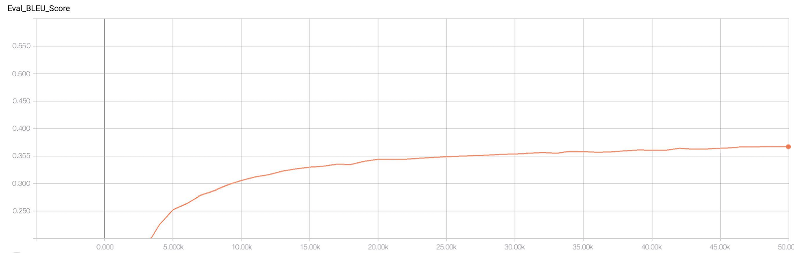
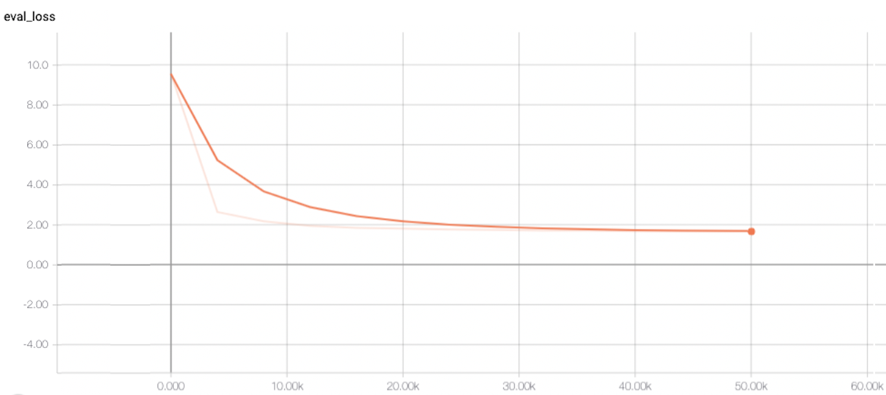
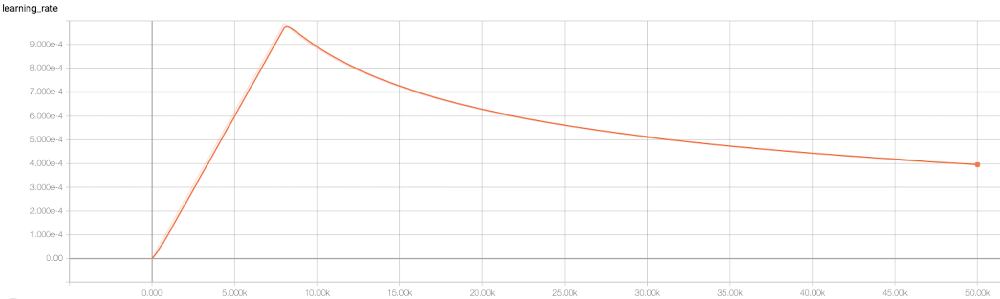

* How long does it take to complete the training run? (hint: this session is on distributed training, so it *will* take a while)

**It took me 30 hours for 50000 steps**

* Do you think your model is fully trained? How can you tell?

**I don't think my model is fully-trained because the eval loss is still descending and not flattened, I will need more training.**

* Were you overfitting?

**I don't think so. The training loss was only slightly(1.59) lower than the eval loss(1.62).**

* Were your GPUs fully utilized?

**Yes, I checked the usage with `nvidia-smi` and my GPUs were fully utilized.**

* Did you monitor network traffic (hint:  ```apt install nmon ```) ? Was network the bottleneck?

**Yes, I monitored network traffic with nmon. The network was not the bottleneck because the GPUs were fully utilized and the Peak->Recv was not 100%.**

* Take a look at the plot of the learning rate and then check the config file.  Can you explan this 
setting?

**In `lr_policy_params` in the config file, we set up the warmup steps as 8000 steps. The learning rate went up and started to drop after 8000 steps.**

* How big was your training set (mb)? How many training lines did it contain?

**The English training set was 622 mb and German training set was 695 mb. There are 4524868 lines.**

* What are the files that a TF checkpoint is comprised of?

**A TF checkpoint comprised of three files: a .meta file, an index file, and a data file itself with weights.**

* How big is your resulting model checkpoint (mb)?

**The resulting model checkpoint is 712 mb.**

* Remember the definition of a "step". How long did an average step take?

**It took around 4 mins for 100 steps, so each step took around 1.667 sec.**

* How does that correlate with the observed network utilization between nodes?

**The global state was updated at the end of each step, so the observed network utilization went up between nodes.**


BLEU plot:


Eval loss:


Learning rate:

